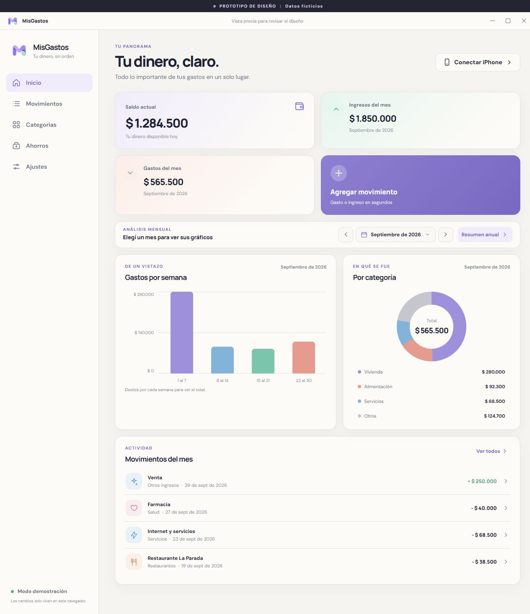
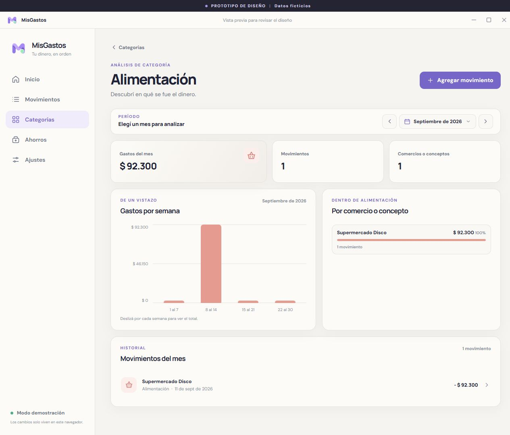
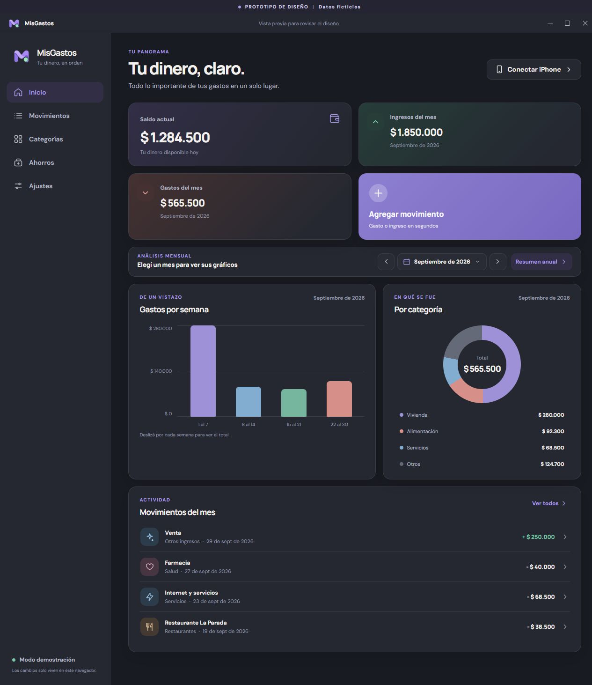
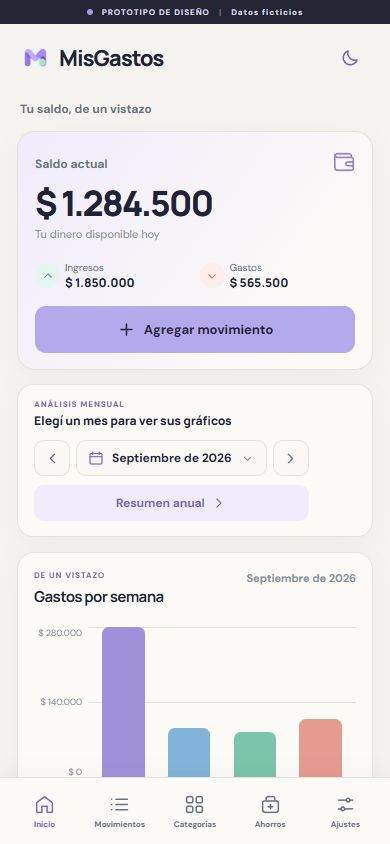
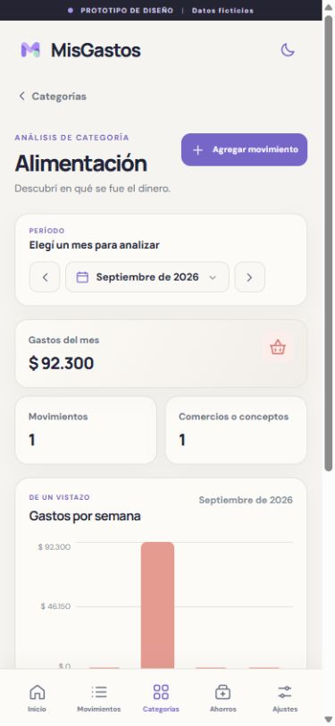
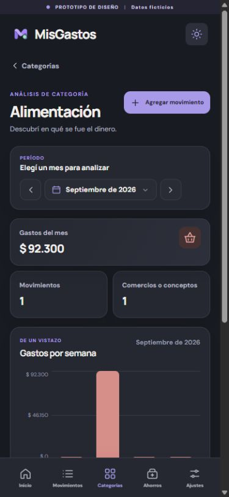

<p align="center"></p>

<h1 align="center">MisGastos</h1>

<p align="center">Tus movimientos, categorías y ahorros en un solo lugar.</p>

<p align="center"><a href="https://github.com/ValentinTarnovsky/MisGastos/releases/latest"><strong>Descargar para Windows</strong></a> · <a href="#capturas">Ver capturas</a> · <a href="LICENSE">Licencia MIT</a></p>

MisGastos es una aplicación de escritorio para Windows. Guarda los datos en SQLite en tu PC y permite consultarlos y editarlos desde Safari en un iPhone vinculado por QR. No requiere crear una cuenta.

## Qué podés hacer

- Registrar ingresos y gastos en pesos argentinos, con saldo inicial y categorías propias.
- Editar, borrar, recategorizar y buscar movimientos.
- Reutilizar descripciones con sugerencias basadas en compras anteriores de la misma categoría. Un campo de detalle opcional distingue cada compra.
- Ver gráficos por mes, resumen anual y análisis de cada categoría por comercio o concepto. Los nombres duplicados se pueden unir.
- Registrar ahorros en ARS o USD. Para compras de dólares, anotás también el importe pagado en ARS.
- Cambiar entre tema claro y oscuro. La interfaz se adapta a PC e iPhone.
- Exportar, restaurar y conservar copias locales automáticas.
- Vincular un iPhone con un QR temporal, aprobarlo desde la PC y revocar el acceso cuando quieras.
- Enviar capturas o mensajes a un bot privado de Discord, corregir su propuesta y confirmar un lote antes de guardarlo.

## Capturas

Las capturas usan **datos ficticios** de la vista de demostración. Tus datos reales empiezan vacíos.

### Escritorio



<details>
<summary>Ver análisis por categoría y tema oscuro</summary>





</details>

### iPhone

<table>
  <tr>
    <td align="center"><strong>Inicio</strong></td>
    <td align="center"><strong>Categoría</strong></td>
    <td align="center"><strong>Modo oscuro</strong></td>
  </tr>
  <tr>
    <td></td>
    <td></td>
    <td></td>
  </tr>
</table>

## Instalar en Windows

1. Descargá el instalador desde [la última versión](https://github.com/ValentinTarnovsky/MisGastos/releases/latest).
2. Ejecutalo y abrí **MisGastos** desde el acceso directo del escritorio o el menú Inicio.
3. En **Ajustes**, cargá tu saldo inicial en ARS. Después agregá tus movimientos.

El instalador todavía no tiene un certificado de firma comercial, por lo que Windows puede mostrar "Editor desconocido". Descargalo desde este repositorio y, si querés verificarlo, compará su SHA-256 con el publicado en la versión.

La primera apertura muestra la ventana. En los siguientes inicios de Windows, MisGastos se inicia oculto y queda en la bandeja, bajo la flecha junto al reloj. Al cerrar la ventana sigue funcionando en segundo plano. Desde el icono de la bandeja podés abrirla, activar o desactivar el inicio con Windows y salir por completo.

## Vincular un iPhone

1. Mantené la PC encendida, con sesión iniciada y sin suspensión.
2. En MisGastos para Windows, abrí **Conectar iPhone**.
3. Elegí la dirección de tu Wi-Fi si ambos equipos comparten la red, o la dirección de Tailscale si vas a usarlo fuera de casa.
4. Escaneá el QR con el iPhone y abrí el enlace en Safari.
5. Aprobá la solicitud que aparece en la PC. En Safari podés usar **Compartir > Agregar a Inicio** para crear el acceso directo con el logo.

El QR vence a los cinco minutos. Los celulares vinculados aparecen en **Ajustes** y se pueden revocar. El acceso móvil usa el servidor local de la PC en el puerto `4174`. No abras ese puerto a Internet; para acceder fuera de casa, usá Tailscale en ambos dispositivos. El iPhone accede mediante Safari, mientras que la aplicación instalada se ejecuta en Windows.

## Registrar desde Discord

1. Creá una aplicación y su bot en [Discord Developer Portal](https://discord.com/developers/applications). Activá **Message Content Intent** en la sección Bot.
2. Invitá el bot a un servidor privado con permisos para ver el canal elegido, leer el historial y enviar mensajes. Copiá el ID de ese canal desde Discord con el modo desarrollador activado.
3. Instalá [Codex CLI](https://learn.chatgpt.com/docs/codex/cli) en la PC y ejecutá `codex login` con tu cuenta de ChatGPT. Comprobá con `codex login status` que diga `Logged in using ChatGPT`.
4. En la app de Windows, abrí **Ajustes > Discord > Configurar bot** y pegá el token del bot y el ID del canal. Activá el bot y guardá.
5. Mandá una captura o un texto como `560 en Starbucks`. El bot te devuelve una lista. Escribí `ignora el 2`, `el 3 va en Comida` o `recordá que Pepito Miguel es verdulero` para corregirla. Para cargar un pago único de tarjeta que quedó excluido de una captura, escribí por ejemplo `Cuotas Mercado Pago $53.349 en Credito`. Escribí `guardar` para registrar las filas marcadas.

Solo el dueño del servidor puede darle instrucciones al bot, y solo en el canal configurado. La PC tiene que estar encendida y MisGastos activo en segundo plano. Al reconectarse, el bot revisa los 100 mensajes más recientes del canal. Las capturas enviadas se procesan con GPT-6 Luna en Fast mode mediante Codex CLI y consumen el límite de uso de tu plan ChatGPT. No se necesita ni se usa una clave de OpenAI API. Fast mode consume más cuota que el modo estándar. El token de Discord se cifra localmente en Windows y no se exporta. Las reglas aprendidas sí se guardan en SQLite y en las copias JSON.

Los cargos en USD y las filas que parezcan de tarjeta de crédito quedan fuera de la propuesta por defecto. Los importes en ARS se redondean al peso más cercano para respetar el formato actual de MisGastos. Revisá la propuesta antes de confirmar, especialmente en transferencias e ingresos de origen incierto.

## Datos y copias

- Base de datos: `%APPDATA%\MisGastos\misgastos.sqlite`.
- Copias automáticas: `%APPDATA%\MisGastos\backups\`.
- Diagnóstico: `%APPDATA%\MisGastos\logs\`, también accesible desde **Abrir registros** en el icono de la bandeja. Se guarda un archivo por día con arranques, cierres y errores. La app conserva siete días y limita cada archivo a 1 MB. Un aviso de cierre no registrado indica que la sesión anterior terminó sin pasar por el cierre normal; por sí solo no confirma un crash.
- Exportación y restauración: **Ajustes > Copias de seguridad**.

La base de datos, las copias y los dispositivos vinculados permanecen en tu PC. No están incluidos en este repositorio ni en el instalador. Si cambiás de PC, exportá una copia JSON desde Ajustes y restaurala en la nueva instalación.

## Desarrollar o compilar

Probado en Windows 11 x64 con Node.js 24 y npm 11.

```powershell
npm ci
npm start
```

Para generar la carpeta ejecutable o el instalador:

```powershell
npm run build:win
npm run build:release
```

`build:win` deja una versión ejecutable en `dist/win-unpacked/`. `build:release` genera el instalador de Windows en `dist/`. La app usa Electron para la ventana y la bandeja, un servidor HTTP local para el iPhone y SQLite para persistencia. La interfaz está escrita en JavaScript y CSS sin un servicio en la nube.

## Licencia

MisGastos se distribuye bajo la [licencia MIT](LICENSE). Los iconos de Lucide conservan su [licencia ISC](assets/lucide-license.txt).
